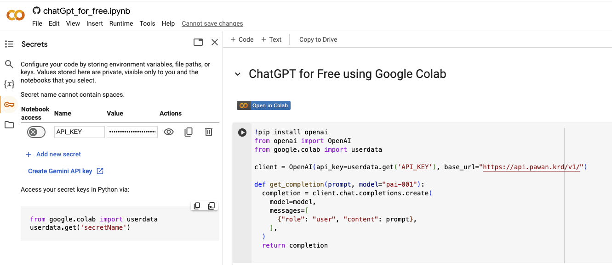

# Running ChatGPT for Free on Google Colab

# Steps:
# 1. Join Discord.com
# 2. Join the Discord channel Pawan.Krd: https://discord.com/channels/1055397662976905229/1118325282932264970
# 3. Get your Own FREE API Key for the Models
#     1. Go to ⁠🤖𝐁𝐨𝐭 https://discord.com/channels/1055397662976905229/1064807234825113621
#     2. Then do the /key command.
#     3. It will give you your own key, make sure to not share it with anyone.
#     4. Click on the Key icon in Google Colab right side.
#     5. Click on "+ Add new secret".
#     6. Add name "API_KEY"
#     7. Add value "key obtained in step 3"

